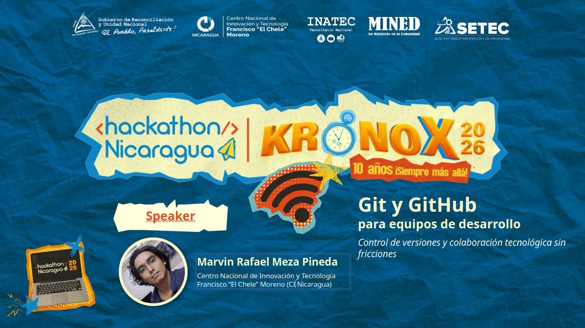
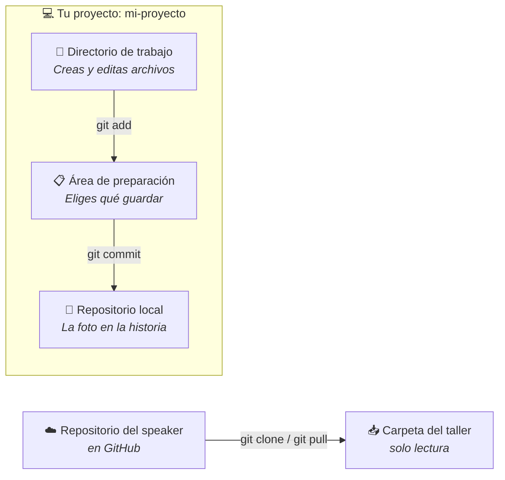
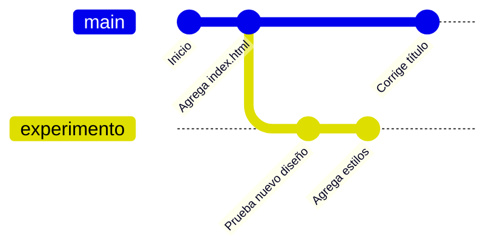

<p align="center">
  
</p>

<h1 align="center">🚀 Git y GitHub para Equipos de Desarrollo</h1>

<p align="center">
  <b>Control de versiones y colaboración tecnológica sin fricciones</b><br>
  Taller práctico · 8 de octubre de 2026 · CI Nicaragua
</p>

<p align="center">
  
  
  
  <br>
  
  
  
  
</p>

---

¡Bienvenido al repositorio oficial del taller! 👋
Aquí aprenderás los fundamentos del **control de versiones** directamente desde la **terminal**: traer un proyecto con `git pull`, crear tu propio repositorio, guardar cambios con commits, revisar la historia y trabajar con ramas. ⌨️

> 💡 **Ya aprendimos a escribir código; ahora aprenderemos a protegerlo y organizarlo como profesionales.**

---

## 📑 Contenido

- [🎯 Objetivo](#-objetivo)
- [🗓️ Agenda del taller](#️-agenda-del-taller)
- [🧰 Antes de empezar](#-antes-de-empezar)
- [🧠 Conceptos clave](#-conceptos-clave)
- [🛠️ Práctica paso a paso](#️-práctica-paso-a-paso)
- [🏆 Reto final](#-reto-final)
- [🌟 Bonus: colabora con un Pull Request](#-bonus-colabora-con-un-pull-request-opcional)
- [📋 Chuleta de comandos](#-chuleta-de-comandos)
- [✅ Buenas prácticas](#-buenas-prácticas)
- [📚 Para seguir aprendiendo](#-para-seguir-aprendiendo)
- [👨‍💻 Speaker](#-speaker)

---

## 🎯 Objetivo

Desarrollar conocimientos prácticos sobre **Git** y **GitHub** para gestionar proyectos de software, controlar versiones y sentar las bases de la colaboración en equipos de desarrollo.

<table>
  <tr>
    <td align="center" width="25%">📥<br><b>Trae</b><br>proyectos con <code>git pull</code></td>
    <td align="center" width="25%">📸<br><b>Guarda</b><br>tu avance con commits</td>
    <td align="center" width="25%">🌿<br><b>Experimenta</b><br>con ramas sin romper nada</td>
    <td align="center" width="25%">🙈<br><b>Protege</b><br>lo sensible con <code>.gitignore</code></td>
  </tr>
</table>

---

## 🗓️ Agenda del taller

| ⏰ Hora | Bloque | Duración |
|:---:|---|:---:|
| 3:15 p.m. | 👋 Bienvenida y presentación del speaker | 5 min |
| 3:20 p.m. | 🧠 Introducción: ¿qué es Git y por qué usarlo? | 15 min |
| 3:35 p.m. | 🛠️ **Taller práctico** (módulos 1 al 6) | **75 min** |
| 4:50 p.m. | 💬 Preguntas, conclusiones y 🎬 demo en vivo: `push` y Pull Request | 15 min |
| 5:05 p.m. | 📲 Escaneo de asistencia para certificación y cierre | 10 min |

### ⏱️ Así se reparten los 75 minutos de práctica

| Módulo | Tema | Tiempo |
|:---:|---|:---:|
| 1 | ⚙️ Configura Git | 5 min |
| 2 | 📥 Trae el repositorio del taller (`clone` y `pull`) | 10 min |
| 3 | 📁 Crea tu repositorio desde la terminal | 10 min |
| 4 | 📸 Crea, modifica y guarda con commits | 20 min |
| 5 | 🌿 Crea ramas y muévete entre ellas | 20 min |
| 6 | 🙈 `.gitignore`: lo que Git no debe guardar | 10 min |

---

## 🧰 Antes de empezar

Asegúrate de tener todo listo ✔️

- [ ] **Git** instalado → [git-scm.com/downloads](https://git-scm.com/downloads)
- [ ] **Visual Studio Code** instalado → [code.visualstudio.com](https://code.visualstudio.com/)

Verifica tu instalación abriendo una terminal:

```bash
git --version
# git version 2.x.x  ✅ ¡Estás listo!
```

> 🪟 **¿Usas Windows?** Trabaja con **Git Bash** (se instala junto con Git). Así todos los comandos de esta guía (`mkdir`, `touch`, `ls`, `cat`…) funcionan igual en cualquier computadora. En VS Code: *Terminal → Nueva terminal → ˅ → Git Bash*.

> 🙌 **No necesitas cuenta de GitHub** para este taller: solo descargarás el repositorio y trabajarás en tu computadora.

---

## 🧠 Conceptos clave

### 🆚 Git no es lo mismo que GitHub

| | 🟠 **Git** | ⚫ **GitHub** |
|---|---|---|
| **¿Qué es?** | Herramienta de control de versiones | Plataforma en la nube |
| **¿Dónde vive?** | En tu computadora | En internet |
| **¿Necesita internet?** | ❌ No | ✅ Sí |
| **Su trabajo** | Guardar la historia de tu proyecto | Compartir repositorios y colaborar |
| **Metáfora** | 🔧 El motor | 🏠 El garaje en la nube |

### 🔄 Cómo trabajaremos hoy

<table>
  <tr>
    <td align="center" width="33%">1️⃣<br><b>Clonas</b><br>este repositorio una sola vez</td>
    <td align="center" width="33%">2️⃣<br><b>El speaker sube</b><br>material nuevo en cada módulo</td>
    <td align="center" width="33%">3️⃣<br><b>Tú haces <code>git pull</code></b><br>y lo recibes al instante</td>
  </tr>
</table>

Mientras tanto, **practicas en tu propio repositorio** (`mi-proyecto`), en una carpeta aparte:

```text
📂 Escritorio/
├── 📥 NOMBRE-DEL-REPO/   ← material del taller: aquí SOLO haces git pull
└── 🛠️ mi-proyecto/       ← tu práctica: aquí haces commits, ramas y todo lo demás
```



> ⚠️ **No hagas commits dentro de la carpeta del taller.** Si tu copia y la del speaker se separan, el siguiente `git pull` fallará. Úsala solo para recibir material.

### 🌿 Ramas: líneas de trabajo independientes



> Cada rama guarda su propia versión de los archivos. Al cambiar de rama con `git switch`, **tu carpeta cambia** para mostrar la versión de esa rama. 🪄

---

## 🛠️ Práctica paso a paso

> 💻 **Tip:** abre **dos terminales** en VS Code (botón ➕ del panel de terminal): una en la carpeta del taller para hacer `git pull` y otra en `mi-proyecto` para practicar.

> 🔄 **Al inicio de cada módulo**, en la terminal de la carpeta del taller, recibe el material nuevo:
> ```bash
> git pull
> ```

Haz clic en cada módulo para desplegarlo 👇

<details>
<summary><b>⚙️ Módulo 1 · Configura Git por primera vez</b> &nbsp;·&nbsp; ⏱️ 5 min</summary>
<br>

Dile a Git quién eres (aparecerá en cada commit):

```bash
git config --global user.name "Tu Nombre"
git config --global user.email "tu-correo@ejemplo.com"
git config --global init.defaultBranch main
```

Comprueba tu configuración:

```bash
git config --list
```

</details>

<details>
<summary><b>📥 Módulo 2 · Trae el repositorio del taller</b> &nbsp;·&nbsp; ⏱️ 10 min</summary>
<br>

Descarga este repositorio a tu computadora **una sola vez**:

```bash
git clone https://github.com/TU-USUARIO/NOMBRE-DEL-REPO.git
cd NOMBRE-DEL-REPO
git log --oneline          # 📜 mira la historia que ya trae
```

Durante el taller, el speaker irá subiendo material nuevo. Para recibirlo:

```bash
git pull                   # 📥 trae los últimos cambios
```

> 💡 `git clone` copia el repositorio la primera vez; `git pull` lo **actualiza** cada vez que hay algo nuevo.

🎯 **Pruébalo:** el speaker subirá un archivo en vivo. Ejecuta `git pull`, luego `ls` y `git log --oneline`... ¡ahí está! Así es como un equipo recibe el trabajo de los demás. 🤝

</details>

<details>
<summary><b>📁 Módulo 3 · Crea tu repositorio desde la terminal</b> &nbsp;·&nbsp; ⏱️ 10 min</summary>
<br>

Sal de la carpeta del taller y crea tu propio proyecto:

```bash
cd ..                      # ⬆️ sube un nivel
mkdir mi-proyecto          # 📁 crea la carpeta
cd mi-proyecto             # 📂 entra en ella
git init                   # 🎬 conviértela en repositorio
ls -a                      # 👀 verás la carpeta oculta .git
git status                 # 🔍 "No commits yet"
```

> 🧠 La carpeta `.git` es donde vive **toda la historia**. ¡No la borres!

</details>

<details>
<summary><b>📸 Módulo 4 · Crea, modifica y guarda con commits</b> &nbsp;·&nbsp; ⏱️ 20 min</summary>
<br>

**1. Crea archivos** 📝

```bash
touch index.html notas.txt          # crea archivos vacíos
echo "# Mi proyecto" > README.md    # crea un archivo con texto
ls                                  # lista los archivos
git status                          # aparecen en rojo: "Untracked"
```

**2. Prepara y guarda tu primer commit** 📸

```bash
git add README.md                   # prepara un archivo
git status                          # README.md ahora está en verde
git add .                           # prepara todo lo demás
git commit -m "feat: crea estructura inicial del proyecto"
```

**3. Modifica un archivo** ✏️

```bash
echo "Primera idea del proyecto" >> notas.txt   # agrega una línea
cat notas.txt                                   # muestra el contenido
git status                                      # "modified: notas.txt"
git diff                                        # muestra qué cambió exactamente
git add notas.txt
git commit -m "docs: agrega primera idea en notas"
```

**4. Lista tus commits** 📜

```bash
git log                    # historia completa (sal con la tecla q)
git log --oneline          # historia resumida, un commit por línea
```

🎯 **Reto:** modifica `index.html` desde VS Code (`code index.html`), guarda el cambio con un commit y verifica que aparezca en `git log --oneline`.

</details>

<details>
<summary><b>🌿 Módulo 5 · Crea ramas y muévete entre ellas</b> &nbsp;·&nbsp; ⏱️ 20 min</summary>
<br>

**1. Mira en qué rama estás** 📍

```bash
git branch                 # el * marca tu rama actual (main)
```

**2. Crea una rama y cámbiate a ella** 🌱

```bash
git switch -c experimento  # crea la rama "experimento" y entra en ella
git branch                 # ahora el * está en experimento
```

**3. Trabaja en la rama** 🧪

```bash
echo "Probando un diseño nuevo" > diseno.txt
git add diseno.txt
git commit -m "feat: prueba nuevo diseño"
ls                         # diseno.txt está aquí
```

**4. Muévete entre ramas y observa la magia** 🪄

```bash
git switch main            # vuelve a main
ls                         # 😮 ¡diseno.txt desapareció!
git switch experimento     # regresa a experimento
ls                         # ✨ ¡y volvió!
```

**5. Visualiza todas las ramas** 🗺️

```bash
git log --oneline --graph --all
```

> 🧘 No se perdió nada: cada rama guarda su propia versión. Por eso puedes experimentar sin miedo a romper lo que ya funciona en `main`.

</details>

<details>
<summary><b>🙈 Módulo 6 · <code>.gitignore</code>: lo que Git no debe guardar</b> &nbsp;·&nbsp; ⏱️ 10 min</summary>
<br>

El archivo `.gitignore` es una **lista de archivos y carpetas que Git debe ignorar**: contraseñas, claves, archivos temporales o carpetas que se generan solas. Lo que esté en esa lista **nunca** entra en la historia del proyecto.

**1. Crea un archivo "secreto"** 🔑

```bash
git switch main
echo "PASSWORD=123456" > secretos.env
git status                 # 😱 Git quiere guardarlo
```

**2. Crea el `.gitignore`** 🛡️

```bash
echo "secretos.env" > .gitignore
echo "*.log" >> .gitignore
cat .gitignore
git status                 # 🙈 secretos.env ya no aparece
```

**3. Guarda el `.gitignore` en la historia** 📸

```bash
git add .gitignore
git commit -m "chore: agrega .gitignore"
```

> 💡 El archivo `.gitignore` **sí** se guarda en el repositorio, para que todo el equipo ignore los mismos archivos.

</details>

---

## 🏆 Reto final

<p align="center">
  <b>¿Te quedó claro? ¡Demuéstralo! 💪</b>
</p>

Desde la terminal y sin mirar la guía:

- [ ] Crea una carpeta `mi-portafolio` y conviértela en repositorio.
- [ ] Crea `README.md` y `sobre-mi.txt`, y guárdalos en un commit.
- [ ] Modifica `sobre-mi.txt` y guarda el cambio en un segundo commit.
- [ ] Crea la rama `proyectos`, agrega `proyectos.txt` y haz un commit.
- [ ] Regresa a `main` y comprueba que `proyectos.txt` no está.
- [ ] Agrega un `.gitignore` que ignore los archivos `.env`.
- [ ] Muestra tu historia con `git log --oneline --graph --all` 🎉

---

## 🌟 Bonus: colabora con un Pull Request (opcional)

¿Terminaste antes y tienes cuenta de GitHub? Propón un cambio a este repositorio **sin necesitar permisos**:

1. Haz clic en **Fork** 🍴 (arriba a la derecha) para copiar el repositorio a tu cuenta.
2. Clona **tu fork** en una carpeta nueva.
3. Crea una rama: `git switch -c participante/tu-nombre`
4. Agrega tu nombre a la lista de abajo: `- 🧑‍💻 Tu Nombre · @tu-usuario`
5. Haz commit y `git push -u origin participante/tu-nombre`
6. En GitHub, abre un **Pull Request** hacia este repositorio. El speaker lo revisará. ✅

### 🎉 Participantes

<!-- Agrega tu nombre debajo de esta línea -->
- 🧑‍💻 Marvin Rafael Meza Pineda · Speaker

---

## 📋 Chuleta de comandos

| Categoría | Comando | ¿Qué hace? |
|---|---|---|
| 💻 **Terminal** | `mkdir <carpeta>` | Crea una carpeta |
| | `cd <carpeta>` | Entra en una carpeta (`cd ..` para salir) |
| | `ls` / `ls -a` | Lista archivos (`-a` muestra los ocultos) |
| | `touch <archivo>` | Crea un archivo vacío |
| | `echo "texto" >> <archivo>` | Agrega texto a un archivo |
| | `cat <archivo>` | Muestra el contenido de un archivo |
| ⚙️ **Configurar** | `git config --global user.name "..."` | Define tu nombre |
| 📥 **Traer** | `git clone <url>` | Copia un repositorio remoto |
| | `git pull` | Trae los últimos cambios |
| 🎬 **Iniciar** | `git init` | Crea un repositorio nuevo |
| 🔍 **Revisar** | `git status` | Muestra el estado de los archivos |
| | `git diff` | Muestra qué cambió exactamente |
| | `git log --oneline` | Lista los commits resumidos |
| 📋 **Preparar** | `git add <archivo>` / `git add .` | Prepara uno o todos los cambios |
| 📸 **Guardar** | `git commit -m "mensaje"` | Guarda los cambios en la historia |
| 🌿 **Ramas** | `git branch` | Lista las ramas |
| | `git switch -c <rama>` | Crea una rama y se cambia a ella |
| | `git switch <rama>` | Cambia de rama |
| | `git log --oneline --graph --all` | Dibuja todas las ramas |

---

## ✅ Buenas prácticas

<table>
  <tr>
    <th>✅ Hazlo así</th>
    <th>❌ Evita esto</th>
  </tr>
  <tr>
    <td><code>feat: agrega validación de formulario</code></td>
    <td><code>cambios varios</code></td>
  </tr>
  <tr>
    <td>Commits pequeños y frecuentes</td>
    <td>Un commit gigante al final del día</td>
  </tr>
  <tr>
    <td>Usar <code>.gitignore</code> para archivos sensibles</td>
    <td>Guardar contraseñas, tokens o archivos <code>.env</code> en el repositorio</td>
  </tr>
  <tr>
    <td>Experimentar en una rama</td>
    <td>Probar ideas arriesgadas directamente en <code>main</code></td>
  </tr>
  <tr>
    <td>Revisar con <code>git status</code> antes de cada commit</td>
    <td>Usar <code>git add .</code> sin mirar qué se está guardando</td>
  </tr>
</table>

### 🏷️ Mensajes de commit con prefijos

| Prefijo | Úsalo cuando… | Ejemplo |
|---|---|---|
| `feat:` | Agregas una funcionalidad ✨ | `feat: agrega inicio de sesión` |
| `fix:` | Corriges un error 🐛 | `fix: corrige cálculo del total` |
| `docs:` | Cambias documentación 📝 | `docs: actualiza README` |
| `style:` | Ajustas formato, sin cambiar la lógica 🎨 | `style: ordena el código` |
| `chore:` | Tareas de mantenimiento 🔧 | `chore: agrega .gitignore` |

### 🙈 Ejemplo de `.gitignore` para un proyecto real

```gitignore
# Credenciales y variables de entorno
.env
*.key

# Entornos y archivos generados
venv/
__pycache__/
node_modules/

# Archivos temporales
*.log
```

---

## 📚 Para seguir aprendiendo

| Recurso | Descripción |
|---|---|
| 📖 [Pro Git (en español)](https://git-scm.com/book/es/v2) | El libro oficial de Git, gratis |
| 🌳 [Learn Git Branching](https://learngitbranching.js.org/?locale=es_ES) | Aprende ramas jugando, de forma visual |
| 🎓 [GitHub Skills](https://skills.github.com/) | El siguiente paso: subir proyectos y colaborar en GitHub |
| 📘 [Documentación de GitHub](https://docs.github.com/es) | Guías oficiales en español |

---

## 👨‍💻 Speaker

<table>
  <tr>
    <td>
      <b>Marvin Rafael Meza Pineda</b><br>
      Centro Nacional de Innovación y Tecnología Francisco “El Chele” Moreno (CI Nicaragua)
    </td>
  </tr>
</table>

---

<p align="center">
  Hecho con 🧡 para el <b>Hackathon Nicaragua Kronox 2026</b> · <i>10 años ¡Siempre más allá!</i><br>
  ⭐ Si este taller te ayudó, ¡dale una estrella al repositorio!
</p>
